# Week 7 - Hybrid A* Algorithm & Trajectory Generation

---

[//]: # (Image References)
[has-example]: ./hybrid_a_star/has_example.png
[ptg-example]: ./PTG/ptg_example.png

## Assignment: Hybrid A* Algorithm

In directory [`./hybrid_a_star`](./hybrid_a_star), a simple test program for the hybrid A* algorithm is provided. Run the following command to test:

```
$ python main.py
```

The program consists of three modules:

* `main.py` defines the map, start configuration and end configuration. It instantiates a `HybridAStar` object and calls the search method to generate a motion plan.
* `hybrid_astar.py` implements the algorithm.
* `plot.py` provides an OpenCV-based visualization for the purpose of result monitoring.

You have to implement the following sections of code for the assignment:

* Trajectory generation: in the method `HybridAStar.expand()`, a simple one-point trajectory shall be generated based on a basic bicycle model. This is going to be used in expanding 3-D grid cells in the algorithm's search operation.
* Hybrid A* search algorithm: in the method `HybridAStar.search()`, after expanding the states reachable from the current configuration, the algorithm must process each state (i.e., determine the grid cell, check its validity, close the visited cell, and record the path. You will have to write code in the `for n in next_states:` loop.
* Discretization of heading: in the method `HybridAStar.theta_to_stack_num()`, you will write code to map the vehicle's orientation (theta) to a finite set of stack indices.
* Heuristic function: in the method `HybridAStar.heuristic()`, you define a heuristic function that will be used in determining the priority of grid cells to be expanded. For instance, the distance to the goal is a reasonable estimate of each cell's cost.

You are invited to tweak various parameters including the number of stacks (heading discretization granularity) and the vehicle's velocity. It will also be interesting to adjust the grid granularity of the map. The following figure illustrates an example output of the program with the default map given in `main.py` and `NUM_THETA_CELLS = 360` while the vehicle speed is set to 0.5.

![Example Output of the Hybrid A* Test Program][has-example]

---

## Experiment: Polynomial Trajectory Generation

In directory [`./PTG`](./PTG), a sample program is provided that tests polynomial trajectory generation. If you input the following command:

```
$ python evaluate_ptg.py
```

you will see an output such as the following figure.

![Example Output of the Polynomial Trajectory Generator][ptg-example]

Note that the above figure is an example, while the result you get will be different from run to run because of the program's random nature. The program generates a number of perturbed goal configurations, computes a jerk minimizing trajectory for each goal position, and then selects the one with the minimum cost as defined by the cost functions and their combination.

Your job in this experiment is:

1. to understand the polynomial trajectory generation by reading the code already implemented and in place; given a start configuration and a goal configuration, the algorithm computes coefficient values for a quintic polynomial that defines the jerk minimizing trajectory; and
2. to derive an appropriate set of weights applied to the cost functions; the mechanism to calculate the cost for a trajectory and selecting one with the minimum cost is the same as described in the previous (Week 6) lecture.

Experiment by tweaking the relative weight for each cost function. It will also be very interesting to define your own cost metric and implement it using the information associated with trajectories.

***

## Report

#### (1) HybridAStar.expand()

__Input__
* current: 현재 차량의 state. 위치 정보인 (x, y)와 차량이 어디를 향하고 있는지를 나타내는 theta 값, 몇 번 이동한 것인지, goal까지의 cost 값들을 저장하고 있다.
* goal: 목표 지점의 (x, y) 값이다.

앞서 상수로 정해놓은 omega_min 값과 omega_max 범위 내에서 이산적인 간격으로 delta_t 값을 하나씩 가져오는 for 문을 실행한다.
현재 state를 기준으로 delta_t 각도만큼 차량의 방향을 틀어 이동했을 때가 되는 next states 목록을 리턴한다.

따라서 for문을 돌며 보는 delta_t의 개수만큼의 next states가 만들어진다.

```
def expand(self, current, goal):
    g = current['g']
    x, y, theta = current['x'], current['y'], current['t']

    # The g value of a newly expanded cell increases by 1 from the
    # previously expanded cell.
    g2 = g + 1
    next_states = []

    # delta_t는 앞바퀴의 각도를 뜻함.
    # delta_t 각도를 [omega_min, omega_max] 범위 내에서 omega_step 간격마다 이산적으로 정의해두고 
    # for문을 돌며 하나씩 전부 고려한다.
    for delta_t in range(self.omega_min, self.omega_max, self.omega_step):
        omega = self.speed / self.length * np.tan(delta_t)

        next_x = x + (self.speed * np.cos(theta))
        next_y = y + (self.speed * np.sin(theta))

        # theta 값을 normalize 해준다.
        next_theta = self.theta_normalize(theta + omega)

        next_g = g2

        next_f = next_g + self.heuristic(next_x, next_y, goal, self.distance_method)

        state = {
            'x': next_x,
            'y': next_y,
            't': next_theta,
            'g': next_g,
            'f': next_f
        }
        next_states.append(state)

    # 위의 delta_t_list에서의 각각에 대해서 state가 나오므로
    # len(delta_t_list)만큼 return 된다.
    return next_states
```

#### (2) HybridAStar.search()

__Input__
* grid: 지도 정보. 장애물이 없는 cell이라면 0, 장애물이 있는 cell이라면 1의 값을 가지고 있다.

* start: 시작 지점의 (x, y, theta) 값이다.

* goal: 목표 지점의 (x, y) 값이다.

2D인 grid cell을 `NUM_THETA_CELLS`만큼 쌓아 3D 구조로 만든 다음, 해당 위치에서 차량의 heading이 어느 방향으로 있을 때인지 저장하여 3D search space를 구성한다.

`NUM_THETA_CELLS`의 값이 커질수록 차량의 heading은 더욱 세분화된다.

빈 list로 시작하는 `opened` list에는 가장 처음 start state가 저장되고, 이후에는 가장 앞에서 state를 하나 뽑아 이 state를 기준으로 이동이 가능한 다음 state를 다시 `opened` list의 끝에 저장한다.

`closed` list는 현재 (x, y, theta) 값을 가지고 방문한 지점을 표기하는 데에 쓰인다.

`came_from` list는 현재 state에 도달하기 위해 이전에서는 어떤 state를 거쳐서 왔는지, 즉 현재까지 거쳐온 경로를 저장하는 용도로 사용된다.

while 문을 통해 `opened` list에 더이상 확인할 state가 남아 있지 않을 때까지 실행한다.

따라서 목표 지점이 도달했거나 가능한 경로를 못 찾았다면 함수가 종료된다.

```
 Perform a breadth-first search based on the Hybrid A* algorithm.
def search(self, grid, start, goal):
    # Initial heading of the vehicle is given in the
    # last component of the tuple start.
    theta = start[-1]
    # Determine the cell to contain the initial state, as well as
    # the state itself.
    stack = self.theta_to_stack_num(theta)
    g = 0
    s = {
        'f': self.heuristic(start[0], start[1], goal, self.distance_method),
        'g': g,
        'x': start[0],
        'y': start[1],
        't': theta,
    }
    self.final = s
    # Close the initial cell and record the starting state for
    # the sake of path reconstruction.
    # 이미 방문했던 곳을 저장하는 array. >> 3차원
    self.closed[stack][self.idx(s['x'])][self.idx(s['y'])] = 1
    # 현재 상태에 도달하기 위해 어떤 경로를 거쳐서 왔는지 저장하는 array.
    self.came_from[stack][self.idx(s['x'])][self.idx(s['y'])] = s
    total_closed = 1
    opened = [s]
    # Examine the open list, according to the order dictated by
    # the heuristic function.
    while len(opened) > 0:
        # TODO: implement prioritized breadth-first search
        # for the hybrid A* algorithm.

        # opened를 정렬한 다음 현재 state를 하나 꺼내온다.
        opened.sort(key=lambda s : s['f'], reverse=True)
        curr = opened.pop()
        x, y = curr['x'], curr['y']

        # goal에 도달했다면 found를 True로 하고 리턴.
        if (self.idx(x), self.idx(y)) == goal:
            self.final = curr
            found = True
            break

        # Compute reachable new states and process each of them.
        # 다음 state가 reachable 한지 검사하고 opened 리스트에 추가한다.
        next_states = self.expand(curr, goal)
        for n in next_states:
            # 가져온 state의 x, y, theta 정보를 구한다.
            n_x, n_y, n_theta = n['x'], n['y'], n['t']

            n_stack_idx = self.theta_to_stack_num(n_theta)
            if n_stack_idx == self.closed.shape[0]:
                n_stack_idx -= 1
                
            n_x_idx = self.idx(n_x)
            n_y_idx = self.idx(n_y)
            if n_x_idx >= self.closed.shape[1]:
                continue
            if n_y_idx >= self.closed.shape[2]:
                continue

            # 1. n_x, n_y 위치가 장애물이 없는 곳인지
            # 2. map 범위를 벗어나지 않는지
            # 3. 이미 방문했던 곳(closed == 1)이 아닌지를 확인한다.
            if grid[n_x_idx][n_y_idx] != 1 and 0 <= n_x_idx < grid.shape[0] and \
                0 <= n_y_idx < grid.shape[1] and self.closed[n_stack_idx][n_x_idx][n_y_idx] != 1:
                # 대각선에 위치한 cell로 이동하면서
                # 장애물이 있는 cell을 통과했는지를 먼저 검사한다.
                # 장애물을 통과하는 경로라면 불가능한 경로가 되므로 제외.
                if self.diagonal_obstacle_2(x, y, n_x, n_y, grid):
                    continue
                
                # 해당 지점을 가능한 리스트에 추가
                opened.append(n)
                # n 직전에 거쳤던 state는 현재의 state가 된다.
                self.came_from[n_stack_idx][n_x_idx][n_y_idx] = curr
                # 현재 state를 방문한 리스트에 표시
                self.closed[n_stack_idx][n_x_idx][n_y_idx] = 1

    else:
        # We weren't able to find a valid path; this does not necessarily
        # mean there is no feasible trajectory to reach the goal.
        # In other words, the hybrid A* algorithm is not complete.
        found = False

    return found, total_closed
```

위 함수에서 구현한 부분은 (1) expand() 함수에서 리턴한 next states가 이동 가능한 경로인지를 하나씩 확인하는 부분이다.

다음 state에서의 위치는 next_state에 저장된 (n_x, n_y, n_theta) 값이다.

이 위치가 이동 가능한 경로인지 확인하기 위해 따져야 하는 내용은 다음과 같다.

(n_x, n_y) 위치에
1. 장애물이 있어서는 안 되고
2. 지도 범위 밖을 벗어나서는 안 되며
3. 이미 방문한 지점이어서도 안 된다.

위 3가지에 대해 해당되는 점이 없다면 이동이 가능한 경로라고 판단하여 해당 next_state를 `opened` 리스트에 추가한다.
그리고 현재의 state를 거쳐온 state를 저장하는 `came_from` 리스트에 추가하고, 방문한 지점임을 `closed` 리스트에 표시한다.

이렇게 코드를 작성하면 동작은 하지만 아래 결과와 같은 문제점이 있다.

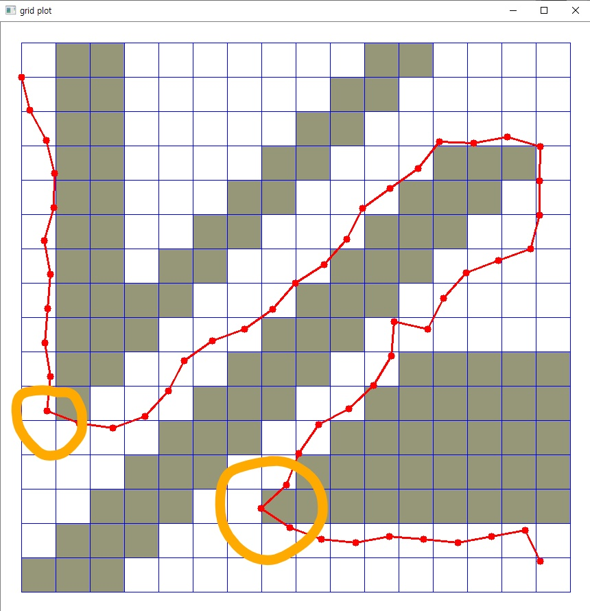

이전 지점인 (x, y)와 다음 지점인 (n_x, n_y)이 장애물인지 아닌지만 확인하고 중간 지점에서는 아무런 검사를 하지 않기 때문에 위 이미지에서 표시한 부분처럼 장애물을 통과하여 경로가 생성되는 문제이다.

이것을 해결하기 위해 위 코드에서 `diagonal_obstacle`이라는 함수를 추가로 작성하였다.

처음 작성한 함수는 다음과 같다.

```
# 대각선에 위치한 cell로 이동할 때 
# (x, y)와 (n_x, n_y)를 지나는 직선의 x절편, y절편을 구하여
# 중간에 장애물이 있는 cell을 통과했는지 검사하는 함수
# 이 함수에서는 기존의 좌표축이 아닌 일반적인 xy-평면으로 바꾸어 계산한다.
def diagonal_obstacle_1(self, x, y, n_x, n_y, grid):
    # 먼저 (x, y)와 (n_x, n_y) 사이의 기울기를 구한다.
    # 좌표축이 반대로 설정되어 있음.
    # (x 증가량 / y 증가량)
    # 일반적인 xy-평면으로 생각하기 때문에 -를 곱함.
    a = -(n_x - x) / (n_y - y)

    # 원점을 서로 대각선에 위치해 있는 cell들이 맞닿는 꼭짓점으로 설정한다.
    # 좌표축도 일반적인 xy-평면처럼 만듦
    o_x = np.floor(x) if x >= n_x else np.floor(n_x)
    o_y = np.floor(y) if y >= n_y else np.floor(n_y)

    p1_x = -(o_y - y) if o_y >= y else y - o_y
    p1_y = o_x - x if o_x >= x else -(x - o_x)

    # y 절편
    y_inter = p1_y - a*p1_x
    # x 절편
    x_inter = -y_inter/a

    # x절편과 y절편을 이용하여 직선이 대각으로 마주보는 사분면 외에 지나는 사분면을 구하고
    # 해당 사분면이 장애물인지를 확인한다.
    o_x = int(o_x)
    o_y = int(o_y)
    if 0 <= o_x < grid.shape[0] and 0 <= o_y < grid.shape[1]:
        if y_inter >= 0 and x_inter >= 0:
            if grid[o_x-1][o_y] == 1:
                return True
        elif y_inter > 0 and x_inter < 0:
            if grid[o_x-1][o_y-1] == 1:
                return True
        elif y_inter < 0 and x_inter < 0:
            if grid[o_x][o_y-1] == 1:
                return True
        elif y_inter < 0 and x_inter > 0:
            if grid[o_x][o_y] == 1:
                return True
    
    return False
```

위 함수는 입력값으로 현재 위치인 (x, y)와 다음 state의 위치인 (n_x, n_y), 그리고 지도 정보인 grid를 받는다.

잘못된 결과가 나오는 부분을 살펴본 결과, 주로 cell의 인덱스가 x 또는 y로만 증가, 감소한 경우가 아니라 

x, y가 모두 증가하거나 감소한 경우, 즉 현재 state의 cell과 next_state의 cell이 대각선으로 만나고 있을 때 이 같은 문제가 발생한다고 생각했다.

때문에 이 함수에서는 (x, y)와 (n_x, n_y)를 잇는 직선을 구하고 

두 위치에 해당하는 cell이 맞닿는 꼭짓점을 원점으로 했을 때, 이 직선이 지나는 사분면에 장애물이 있는지 아닌지를 확인하는 식으로 구현했다.

아래 이미지는 위의 함수를 적용한 결과이다.

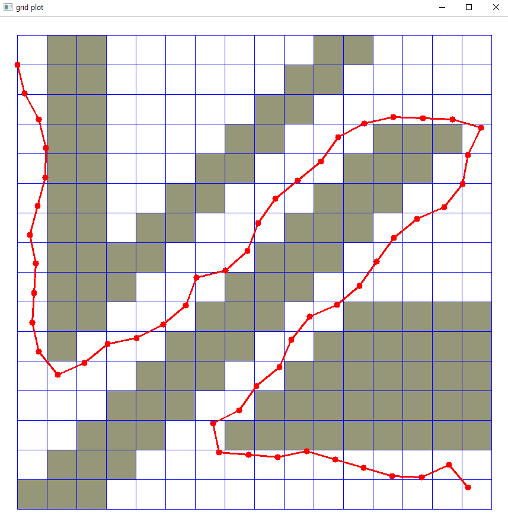

장애물이 있는 cell을 통과하던 문제점이 해결된 것을 확인할 수 있었다.

하지만 차량의 speed를 키웠을 때 똑같은 문제점이 또 발견되었다. (아래 이미지)

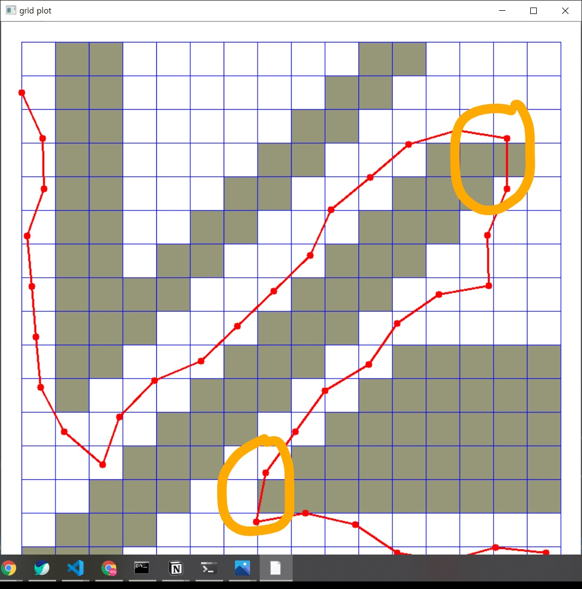

먼저 구현한 함수가 x, y cell에 대해 모두 1씩 증가 또는 감소한 경우만을 따졌기 때문에 

이렇게 speed를 크게 설정했을 때 한 번에 두 개 이상의 cell을 이동했을 때를 판단할 수가 없었던 것이 이유였다.

따라서 아래와 같은 두 번째 함수를 구현했다.

```
# (x, y) (n_x, n_y) 두 점을 지나는 직선을 따라 조금씩 이동하면서
# 중간에 지나는 cell이 장애물인지를 검사하는 함수.
def diagonal_obstacle_2(self, x, y, n_x, n_y, grid):
    # 좌표축이 반대로 설정되어 있음.
    # (x 증가량 / y 증가량)
    a = (n_x - x) / (n_y - y)

    # 직선의 방정식 : y = a(x - x1) + y1
    # x1, y1에는 인자로 받은 x, y값이 들어간다.

    # (x, y)지점에서 (n_x, n_y)지점 방향으로 y값을 step씩 늘리면서 
    # 중간에 장애물을 통과하는지를 판단한다.
    if (y != n_y):
        inter_y_list = np.linspace(y, n_y, int(self.speed//0.1))
        inter_x_list = a*(inter_y_list - y) + x

        for inter_x, inter_y in zip(inter_x_list, inter_y_list):
            inter_x_idx = self.idx(inter_x)
            inter_y_idx = self.idx(inter_y)

            if 0 <= inter_x_idx < grid.shape[0] and 0 <= inter_y_idx < grid.shape[1] and \
                grid[inter_x_idx][inter_y_idx] == 1:
                return True
    # y와 n_y 값이 동일하다면 y = c인 직선이므로
    # (x, y)지점에서 (n_x, n_y)지점 방향으로 x값을 step씩 늘리면서 
    # 중간에 장애물을 통과하는지를 판단한다.
    else:
        inter_x_list = np.linspace(x, n_x, int(self.speed//0.1))
        inter_y_list = [y]*len(inter_x_list)

        for inter_x, inter_y in zip(inter_x_list, inter_y_list):
            inter_x_idx = self.idx(inter_x)
            inter_y_idx = self.idx(inter_y)
            
            if 0 <= inter_x_idx < grid.shape[0] and 0 <= inter_y_idx < grid.shape[1] and \
                grid[inter_x_idx][inter_y_idx] == 1:
                return True
    
    
    return False
```

첫 번째 함수와 비슷하게 (x, y)와 (n_x, n_y)를 지나는 직선의 기울기를 구하지만 

(x, y)에서부터 이 직선을 따라 일정 간격씩 이동하면서 그 지점이 장애물인지 아닌지를 지속적으로 확인한다.

(x, y)를 시작 지점으로 하여 직선을 따라 step씩 이동하면서 (n_x, n_y)에 도착할 때까지 장애물인 포인트가 없었다면 False를 리턴한다.

두 번째 함수를 적용했을 때는 차량의 speed를 높게 설정해주었을 때도 아래 결과처럼 장애물을 통과하는 문제가 발생하지 않았다.

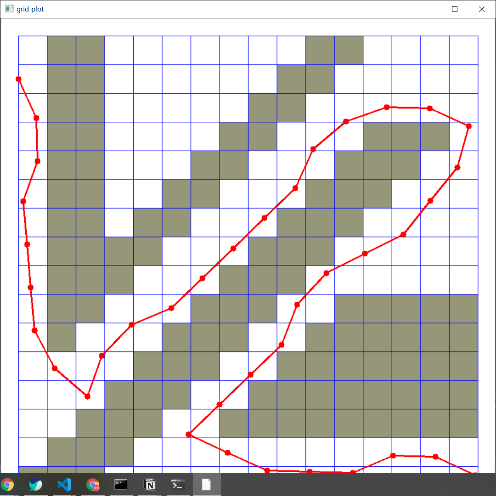


#### (3) HybridAStar.theta_to_stack_num()

__Input__
* theta: 현채 차량이 바라보는 방향.

360도를 `NUM_THETA_CELLS` 값으로 나눠 세분화했을 때, 입력으로 받은 theta 값이 몇 번째 인덱스에 속하는지를 리턴하는 함수이다

아래처럼 작성하였다.

```
# theta 값이 주어지면 heading을 세분화한 stack에서
# 몇 번째 idx에 가야하는 theta 값인지를 판단하는 함수.
def theta_to_stack_num(self, theta):
    interval = 360 / self.NUM_THETA_CELLS

    # 라디안 값인 theta를 360도 기준으로 변환
    theta = math.degrees(theta)

    # idx 값은 theta 값을 interval로 나눈 몫이 된다.
    idx = int(theta // interval)
    if idx == self.NUM_THETA_CELLS:
        idx -= 1

    return idx
```

#### (4) HybridAStar.heuristic()

__Input__
* x: 현재 state에서의 x 포지션
* y: 현재 state에서의 y 포지션
* goal: 목표 지점의 (x, y) 포지션
* distance_method: 현재 state의 위치로부터 goal까지의 거리를 측정할 때 사용할 메소드

기존의 A* 알고리즘에서는 goal까지 남은 칸의 개수를 장애물을 고려하지 않은 채로 세는 방식이었다.
Hybrid A* 알고리즘에서는 x, y가 연속한 값, 즉 정수가 아닌 포지션을 가지고 있기 때문에 목표 지점까지의 거리를 나타낼 때 L1-distance 또는 L2-distance를 사용하여 계산할 수 있도록 구현했다.

```
def heuristic(self, x, y, goal, distance_method):
    # goal은 (x, y) 형태.
    if distance_method == "L1":
        # 현재 지점과 goal 지점 사이의 L1-distance를 측정
        distance = np.abs(goal[0] - x) + np.abs(goal[1] - y)
    else:
        # 현재 지점과 goal 지점 사이의 L2-distance를 측정
        distance = math.sqrt((goal[0] - x)**2 + (goal[1] - y)**2)

    return distance
```

***


## Test
아래 모든 테스트에서 omega_step의 값은 5가 사용되었다.

### `NUM_THETA_CELLS` 값을 바꾸었을 때

speed = 1.0, |omega| = 35

1. NUM_THETA_CELLS = 90 <br>


2. NUM_THETA_CELLS = 180 <br>


3. NUM_THETA_CELLS = 270 <br>
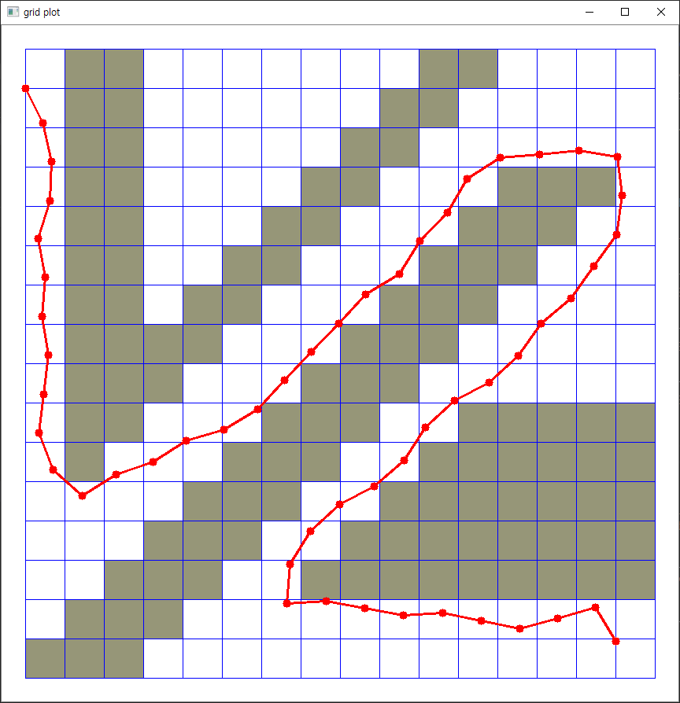

4. NUM_THETA_CELLS = 360 <br>
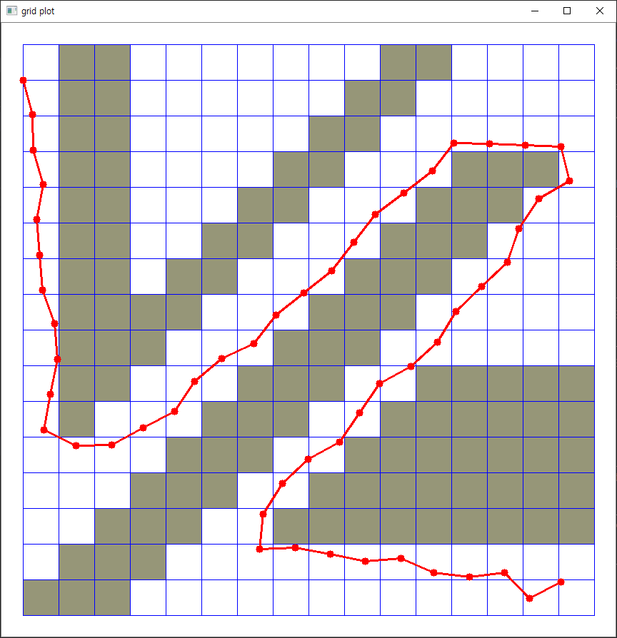

차량의 speed를 1.0으로 설정했을 때는 뭔가 크게 달라진 것을 확인할 수 없었다.

<br>

그래서 speed를 0.5로 설정한 다음, NUM_THETA_CELLS = 90일 때와 NUM_THETA_CELLS = 360일 때를 비교해 보았다.

1. NUM_THETA_CELLS = 90 (speed = 0.5) <br>


2. NUM_THETA_CELLS = 360 (speed = 0.5) <br>
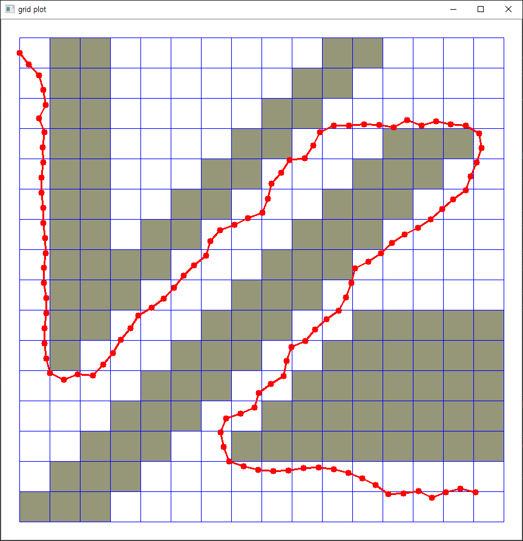

이렇게 비교하니 NUM_THETA_CELLS 값을 크게 줄수록 차량의 방향을 더욱 세부적으로 나눌 수 있다는 점이 경로가 크게 비뚤어지지 않고 안정적으로 나오게끔 영향을 미친다는 것을 확인할 수 있었다.

<br><br>

### `omega_min` 값과 `omega_max` 값을 바꾸었을 때

NUM_THETA_CELLS = 180, speed = 1.0

1. |omega| = 35 <br>


2. |omega| = 70 <br>
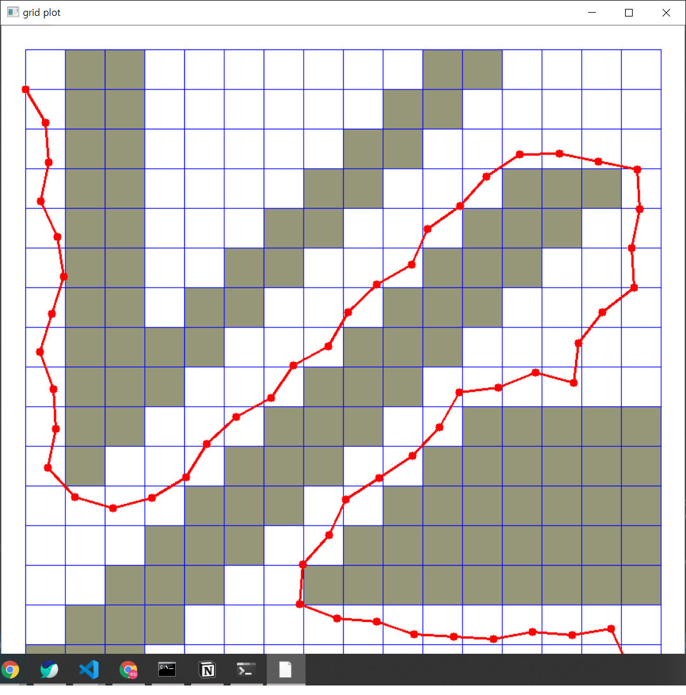

3. |omega| = 105 <br>
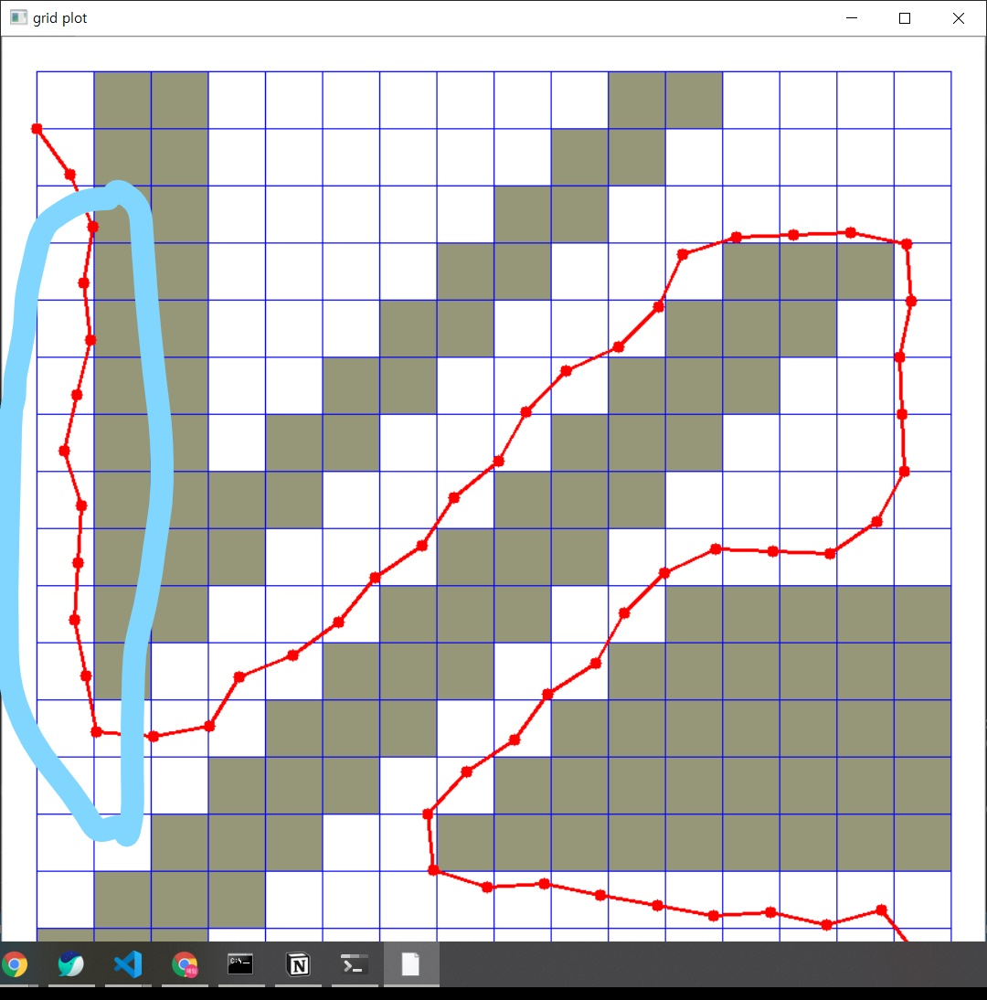

조향각의 min, max 값을 더 크게 키울수록 세 번째 이미지에 표시한 구간에서 벽에 가깝게 붙어 이동하도록 최적화되는 것 같다.

위의 세팅에서 L2-distance를 사용했기 때문에 왼쪽 상단에서 오른쪽 하단에 최대한 가까워지도록 하는 대각선 방향으로 이동을 했지만 이 경우 벽에 너무 가까워질 수 있어서 계속해서 움직이려면 벽에서 다시 멀어져야 한다.

조향각의 min, max 값이 작을 때는 한 스텝만에 차량의 방향을 크게 돌려 벽에서 떨어질 수가 없고, 조향각의 min, max 값이 크면 벽에 붙게 되었을 때도 한 스텝 안에 차량의 방향을 크게 틀어 벽에서 멀어질 수 있기 때문에 벽에 바짝 붙은 경로가 결과로 나오는 것이 아니었을까 생각했다.

<br><br>

### L1-distance와 L2-distance를 바꾸어 적용했을 때

1. L1-distance <br>
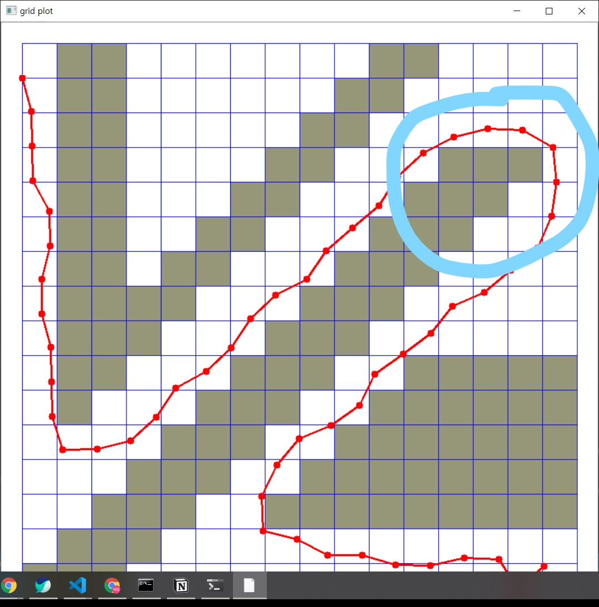

2. L2-distance <br>
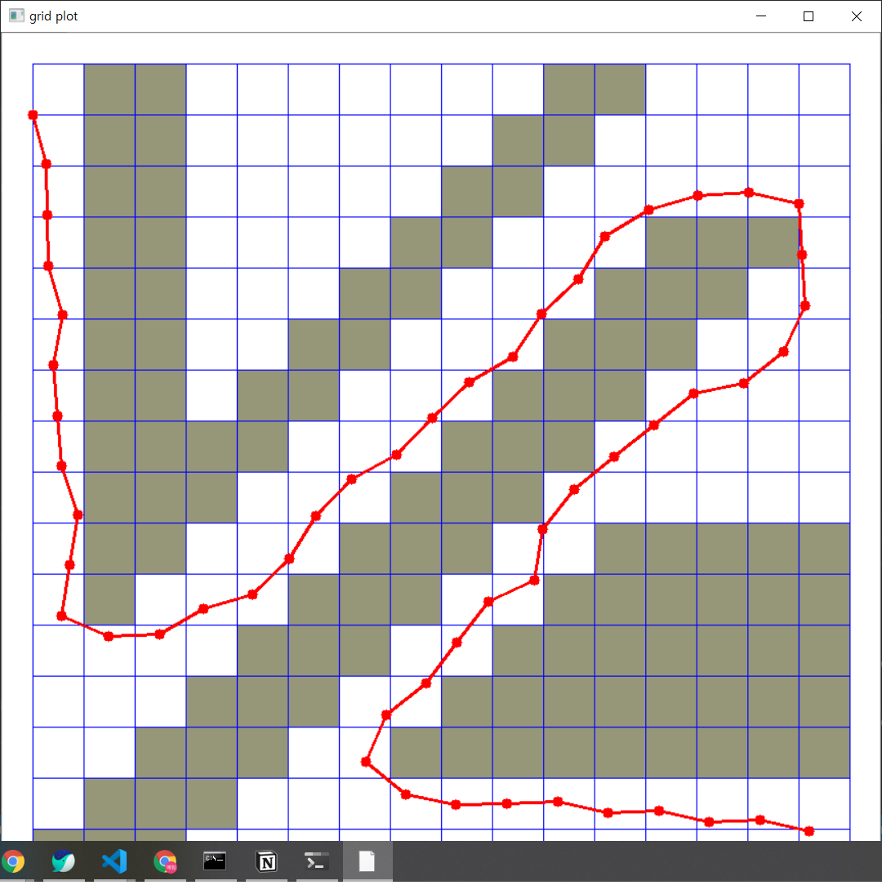

L1-distance의 이미지에 표시한 부분처럼 코너를 돌 때는 L1-distance를 사용했을 때 더 실제 차량처럼 부드럽게 회전하는 결과가 나왔다.

L1 distance를 사용하면 단순히 x축으로의 거리, y축으로의 거리를 따로 고려하기 때문에, 아래로 쭉 내려오면 되는 초반 구간에서 구불구불하게 내려오지 않을 거라고 생각했지만 L1 distance를 사용해도 비슷한 것처럼 보였다.

<br>

이에 좀더 차량의 상태를 세분화한 환경에서의 결과를 확인해보려고 `NUM_THETA_CELLS`의 값을 360, omega_min과 omega_max 값을 -70, 70으로 설정한 뒤 다시 실행했다.

1. L1-distance (NUM_THETA_CELLS = 360, |omega| = 70) <br>
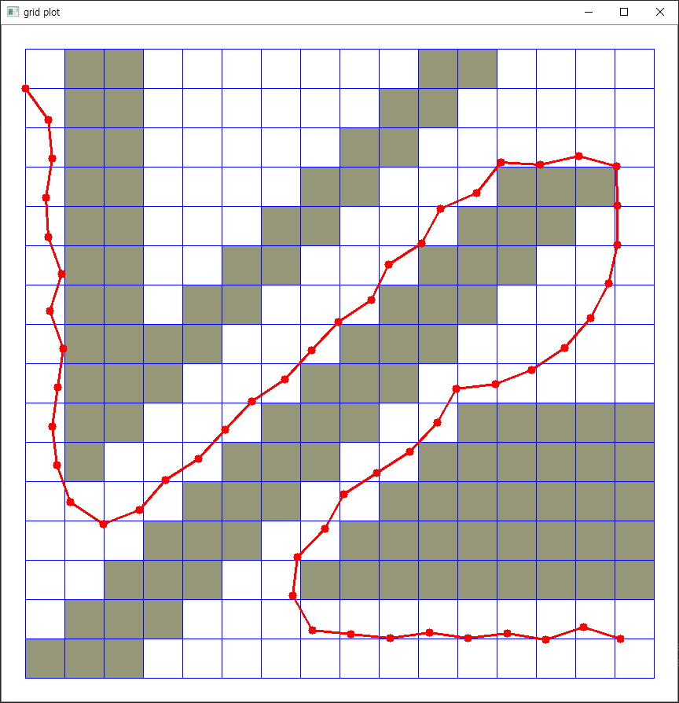

2. L2-distance (NUM_THETA_CELLS = 360, |omega| = 70) <br>
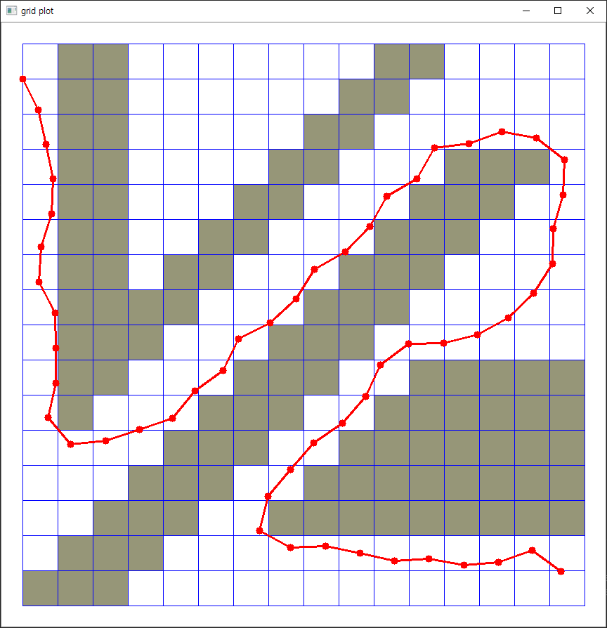

역시 크게 의미 있어 보이는 차이를 찾지 못했다.

<br><br>

### 차량의 speed를 바꾸어 적용했을 때

NUM_THETA_CELLS = 180, |omega| = 35

1. speed = 0.5 <br>


2. speed = 1.0 <br>


3. speed = 1.5 <br>
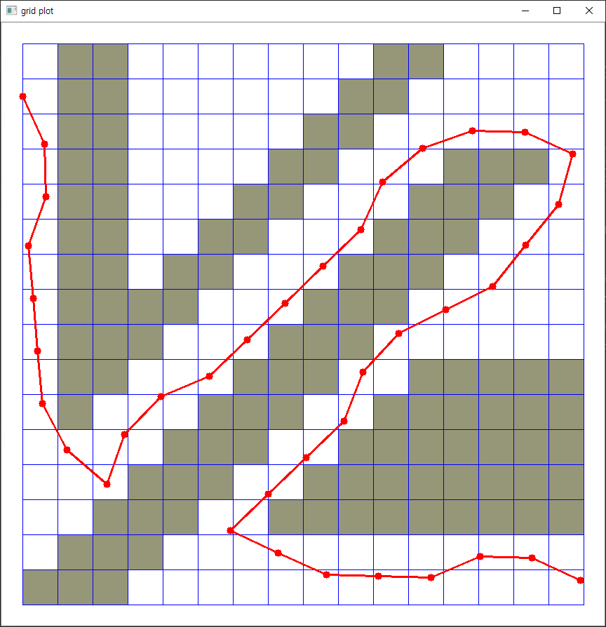

speed가 작을수록 조금씩 전진하여 그때마다의 최적 경로를 탐색하기 때문에 전체적으로 더 부드러운 움직임을 보인다.

<br>

speed가 클수록 한 step에 많이 전진하기 때문에 조향각의 범위가 큰 영향을 미칠 거라고 생각했다.

아래 이미지는 omega_min, omega_max 값을 각각 -20, 20으로 바꾼 다음 실험한 결과이다.

1. speed = 0.5 (|omega| = 20) <br>
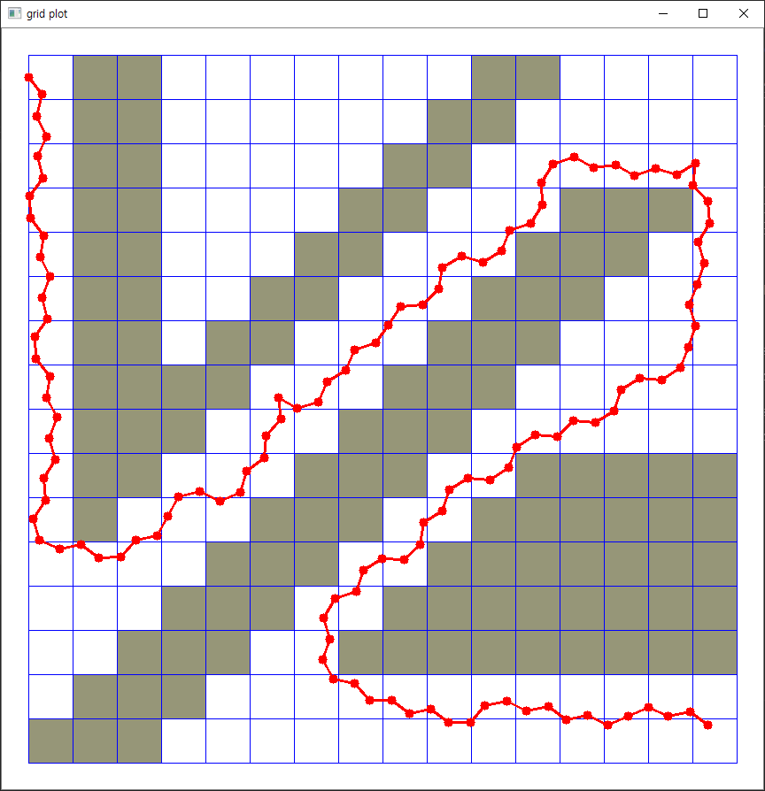

2. speed = 1.5 (|omega| = 20) <br>
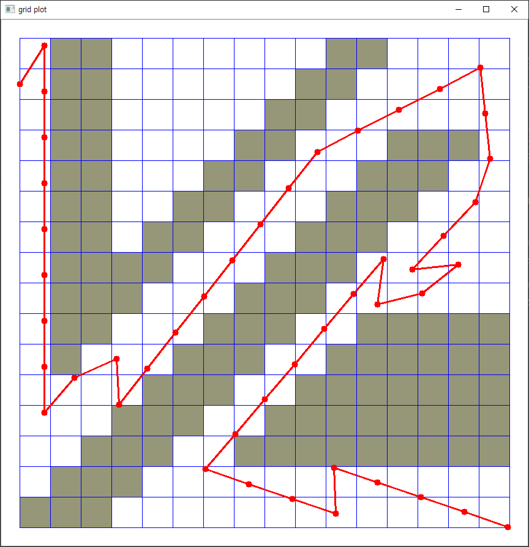

speed가 작은 경우에는 조향각의 범위가 좁아도 전진 거리 자체가 좁기 때문에 꽤나 부드럽게 이동한다.

하지만 speed가 큰 경우에는 조향각의 범위가 좁을 때 유효한 길을 따라가기 위해서 한 바퀴를 돈 후에야 길의 방향대로 전진할 수가 있기 때문에 두 번째 결과처럼 불필요한 이동이 많아지게 된다.